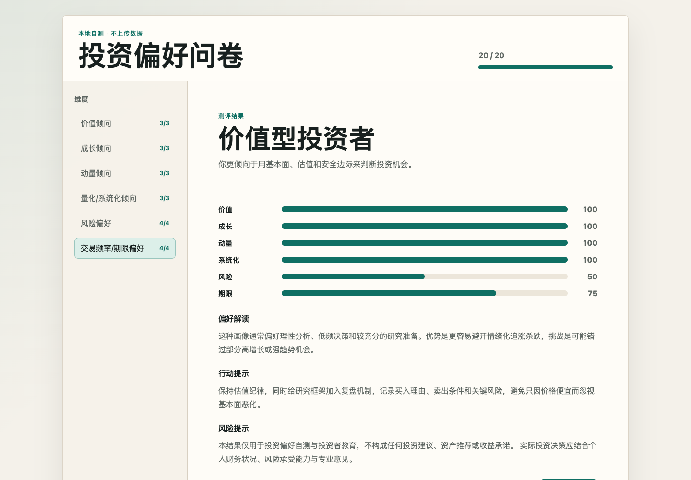

# Investment Style Questionnaire · 投资偏好测试

Discover whether you lean toward value, growth, momentum, systematic investing,
risk-taking, or long-term holding—through a **20-question, privacy-first Chinese
questionnaire** that calculates everything locally in your browser.

**[Take the free questionnaire →](https://investment-preference.pages.dev/)**

**Project status:** active



<details>
<summary>See the question flow</summary>


</details>

> 中文：这是一个纯静态投资风格自测工具。无需登录，答卷不会离开浏览器，完成后即时生成六维分数和风格画像。

## Why this project

- **Six interpretable dimensions:** value, growth, momentum, systematic, risk,
  and investment horizon.
- **Transparent scoring:** 1–5 Likert scale with documented reverse-scored items.
- **Private by design:** no account, analytics, cookies, backend, or answer upload.
- **Useful output:** dimension scores, a primary style profile, interpretation,
  and practical reflection prompts.
- **Zero build step:** plain HTML, CSS, and JavaScript; deployable to any static host.

<details>
<summary>中文功能说明</summary>

- 20 道投资/交易偏好题目，采用 1–5 分同意程度评分
- 覆盖价值、成长、动量、系统化、风险偏好和期限偏好六个维度
- 支持反向计分、分步答题、进度显示和遗漏提示
- 在浏览器本地生成风格画像和维度得分
- 不登录、不上传、不保存答卷数据

</details>

## Run locally

直接打开 `index.html`，或在当前目录启动静态服务：

```bash
python3 -m http.server 8789
```

Then open <http://localhost:8789>.

## Deploy to Cloudflare Pages

When importing from GitHub:

- Framework preset: `None`
- Build command: leave blank
- Build output directory: `/`
- Root directory: `/`

Or preview/deploy with Wrangler:

```bash
pnpm dlx wrangler pages dev .
```

```bash
pnpm dlx wrangler pages deploy . --project-name investment-preference-questionnaire
```

## Data, backup, and recovery

- User answers exist only in page memory and disappear on refresh.
- The project has no database or irreplaceable application data.
- There are no generated dependency folders; cloning the repository restores the
  complete app.

## Scope and limitations

This is an educational self-reflection tool, not a validated psychometric test,
financial advice, an asset recommendation, or a promise of returns. Real decisions
should account for your finances, capacity for loss, objectives, and professional
advice where appropriate.

## License

[MIT](LICENSE)
